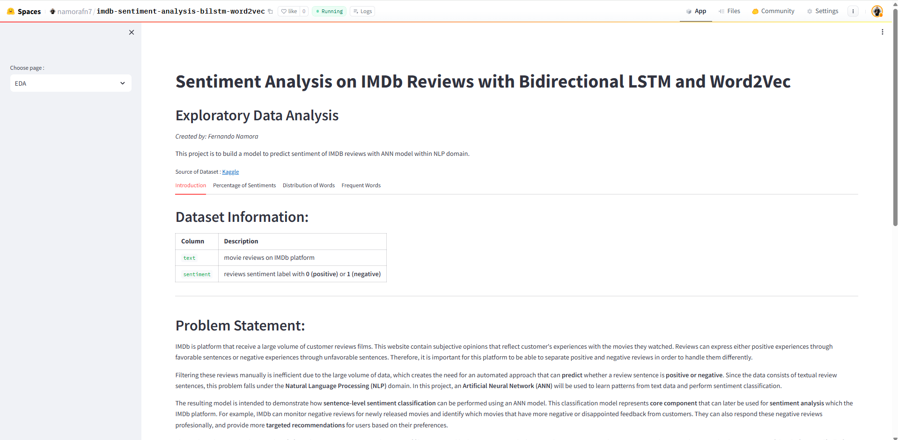
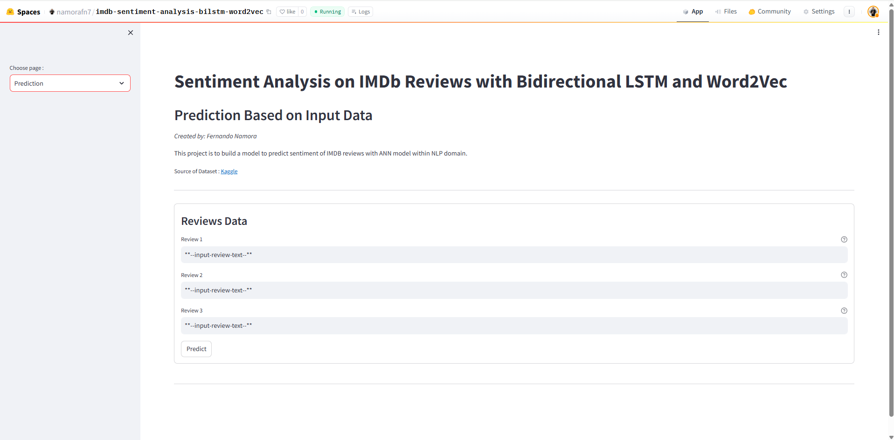
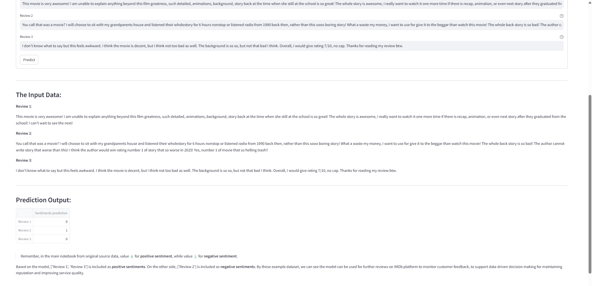

# IMDb Sentiment Analysis using Bidirectional LSTM & Word2Vec

*[Live Demo on Hugging Face Spaces](https://huggingface.co/spaces/namorafn7/imdb-sentiment-analysis-bilstm-word2vec)*  

See the [Model Deployment section](#model-deployment) below for implementation details.

---

## Stacks

All implementation in this project uses **Python**:

- **Data Processing & EDA**: `pandas`, `numpy`, `matplotlib`, `seaborn`
- **NLP Processing**: `nltk`, `contractions`, `gensim`
- **Deep Learning**: `tensorflow`, `keras`
- **Model Evaluation**: `scikit-learn`
- **Model Saving**: `pickle`

---

## Problem Background

IMDb is a large online platform that collects movie reviews from users worldwide. These reviews contain valuable insights regarding user satisfaction, but due to the large volume of data, manual analysis becomes inefficient.

This project aims to build an automated system to **classify review sentiment (positive or negative)** using Natural Language Processing (NLP). The model can help:

- Monitor negative feedback for newly released movies  
- Identify highly rated or poorly received films  
- Support data-driven decisions for platform improvement  

---

## Project Output

This project covers end-to-end NLP modeling, including:

- Data understanding and exploratory analysis (EDA)  
- Text preprocessing and feature engineering  
- Model development using Bidirectional LSTM  
- Model comparison (baseline vs improved approach)  
- Final model evaluation and interpretation  

Two main approaches are implemented:

1. **Model from scratch** using TextVectorization and Embedding  
2. **Improved model** using Word2Vec embeddings (transfer learning)  

The final selected model achieves:
- ~90% training accuracy  
- ~88% validation accuracy  
- **~88% test accuracy**  

---

## Notebook

Full implementation is available in Kaggle:

👉 https://www.kaggle.com/code/namorafn7/imdb-sentiment-analysis-bidirectionallstm-word2vec

### Notebook Outline

- **i. Introduction**  
  > Project background, dataset information, problem statement, and objective  

- **ii. Import Libraries**  
  > Required libraries for NLP and deep learning  

- **iii. Data Loading**  
  > Load and inspect IMDb dataset  

- **iv. Exploratory Data Analysis (EDA)**  
  > Distribution of sentiment labels, word counts, and frequent tokens  

- **v. Feature Engineering**  
  > Text preprocessing (cleaning, tokenization, stopwords handling, stemming)  
  > Train-validation-test split  

- **vi. ANN Training**  
  > Baseline Bidirectional LSTM models trained from scratch  
  > Model complexity analysis and overfitting observation  

- **vii. ANN Improvement**  
  > Word2Vec embedding implementation (transfer learning)  
  > EarlyStopping to prevent overfitting  

- **viii. Model Saving**  
  > Save final model and tokenizer  

- **ix. Conclusion**  
  > Summary of EDA, modeling comparison, and final results  

---

## Data

Source of Dataset:  
https://www.kaggle.com/datasets/jcblaise/imdb-sentiments

| Column | Description |
|--------|------------|
| `text` | IMDb movie review |
| `label` | Sentiment (0 = positive, 1 = negative) |

Dataset characteristics:
- ~25,000 reviews  
- Balanced dataset (positive vs negative)  
- No missing values  

---

## Method

The modeling approach consists of:

### 1. Text Preprocessing  
- Case folding  
- Remove noise (URL, punctuation, numbers)  
- Expand contractions  
- Tokenization  
- Custom stopwords handling  
- Stemming  

Special handling:
- Keep sentiment-important words (`not`, `but`, `very`, etc.)  
- Remove domain-neutral words (`movie`, `film`)  

---

### 2. Model Development  

#### Model 1 — Baseline  
- TextVectorization + Embedding  
- Bidirectional LSTM (2 layers)  
- Result: Overfitting  

#### Model 2 — Reduced Complexity  
- Smaller vocab and sequence length  
- Single LSTM layer  
- Result: Still overfitting  

#### Model 3 — Final Model  
- Word2Vec embeddings  
- Embedding layer frozen (transfer learning)  
- Bidirectional LSTM  
- EarlyStopping applied  

---

### 3. Model Evaluation  

- Evaluation metric: **Accuracy** (balanced dataset)  
- Final model performance:
  - Train: ~90%  
  - Validation: ~88%  
  - Test: **~88%**  

- Additional analysis:
  - Correct predictions (true positive / true negative)  
  - Incorrect predictions (false positive / false negative)  
  - Word frequency analysis for model behavior  

---

## Model Deployment

For live model interaction, kindly visit the following link *[Hugging Face Model Deployment Link](https://huggingface.co/spaces/namorafn7/imdb-sentiment-analysis-bilstm-word2vec)*.

The deployed application allows users to:
- Input custom review text  
- Get real-time sentiment prediction

The deployed application consists of two main pages:

1. **EDA page**   
   This page presents brief explanation about the project's problem statement and objective along with EDA questions as the idea for 
   visualizations and insights based on the historical dataset (`train.csv`) from Kaggle dataset. Users can explore the data patterns
   and understand the background analysis used before modeling.
3. **Prediction page**   
   This page allows users to input custom new sentiment reviews (up to 3 reviews), and obtain real-time predictions from the deployed
   model built with Streamlit.

### Screenshots of the Web Application

- **EDA Page**  
    
  Visitors can scroll through the page and tabs to explore visualizations and insights, the basis of modeling process.

- **Prediction Page**  
    
  This page provides the user interface for entering new review sentiment to be classified positive or negative.

- **Prediction Example**  
    
  Example of a prediction result generated from user input.

---

## Key Insights

- Training embedding from scratch leads to overfitting  
- Word2Vec improves generalization significantly  
- Sequence length selection impacts performance  
- Some stopwords are important for sentiment (negation, contrast)  

---

## Limitations

- Difficulty handling:
  - Sarcasm  
  - Ambiguous sentences  
  - Mixed sentiment reviews  

- Some words appear in both sentiment classes (context-dependent)

---

## Future Improvements

- Try GRU (lighter alternative to LSTM)  
- Use pretrained embeddings (GloVe / FastText)  
- Fine-tune embedding instead of freezing  
- Explore transformer-based models (BERT)  
